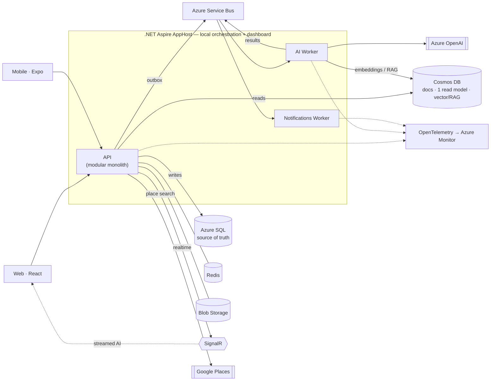

# Explivio — Architecture

> A modern, distributed **.NET 10** trip-planning platform with **AI** at its core.
> Built as a reference-quality showcase: event-driven, observable, tested, and cloud-native.

---

## 1. Intent & guiding principles

Explivio demonstrates the ability to design and build a **modern .NET distributed system with first-class AI support**. The architecture optimizes for:

- **Clear seams over sprawl** — a modular-monolith API with vertical slices, plus a small number of independently-deployed workers where independent scaling genuinely matters (AI, notifications). Not cargo-cult microservices.
- **Event-driven & reliable** — domain events over a message broker, with the transactional outbox pattern so nothing is lost or duplicated.
- **AI as a product capability, not a bolt-on** — RAG, agentic tool-calling, structured outputs, streaming, and AI observability.
- **Operable by default** — OpenTelemetry traces/metrics/logs, health checks, resilience pipelines, from day one.
- **Provable** — integration tests against real dependencies (Testcontainers), CI/CD via GitHub Actions.

**Principle:** every architectural choice should be defensible in an interview. Prefer the idiomatic 2026 .NET approach and be able to explain the trade-off.

---

## 2. System topology



**Deploy:** `azd` → Azure Container Apps (Bicep generated/augmented from the Aspire model).

### Deployable units
| Unit | Responsibility | Why separate |
|---|---|---|
| **API** | HTTP surface, command/query handling, writes, real-time hub | The core; stays a modular monolith |
| **AI Worker** | Consumes AI jobs (itinerary generation, embeddings, receipt/email parsing), calls Azure OpenAI, streams results back | Bursty, latency-heavy, scales independently of the API |
| **Notifications Worker** | Consumes domain events → push / in-app / email | Decouples fan-out side-effects from request path |
| **AppHost** (dev only) | Orchestrates all services + backing resources locally, wires config/discovery, hosts the dashboard | Aspire developer inner-loop |
| **ServiceDefaults** (library) | Shared OpenTelemetry, health checks, resilience, service discovery | Consistent cross-cutting wiring across every service |

---

## 3. Backend architecture (the API)

**Modular Monolith + Vertical Slice.** Each module owns its domain; each feature is a self-contained slice.

```
Modules/
  Trips/        Users/        Itinerary/        Budget/   (+ future: Places, Collaboration, AI, Social)
    Feature/
      XCommand.cs / XQuery.cs   ← MediatR request
      XHandler.cs               ← business logic
      XValidator.cs             ← FluentValidation
    XModule.cs                  ← Minimal API endpoint mapping
    Entity.cs                   ← domain type
```

**Request pipeline (MediatR behaviors):**
`Endpoint → ValidationBehavior → LoggingBehavior → Handler`

- **Validation** moves out of endpoints into a pipeline behavior → slices stay thin.
- **Idempotency lives at the boundaries, not in the mediator:** mutating HTTP endpoints honor an `Idempotency-Key` header; message consumers dedupe on message id. (The in-process mediator pipeline is the wrong layer for it.)
- **Errors:** expected failures flow as a `Result` type (not-found, forbidden, conflict); unexpected exceptions are caught by a global `IExceptionHandler` and rendered as **ProblemDetails (RFC 9457)**.
- **API surface:** Minimal APIs grouped per module (`MapXEndpoints()`), `.Produces<T>()` annotations, **API versioning**, **rate limiting**, **output caching**.
- **Contracts:** C# is the single source of truth → OpenAPI (`/openapi/v1.json`) → `openapi-typescript` generates `@explivio/shared` types. **Types are never hand-written.**

---

## 4. Data architecture

| Store | Role | Notes |
|---|---|---|
| **Azure SQL** (EF Core) | System of record for relational/transactional data (trips, activities, expenses, users) | Migrations checked in |
| **Cosmos DB** | Documents (preferences, activity feed, notifications), **one CQRS read model** (see below), **vector search for RAG** | Serverless; partitioned by user/trip |
| **Redis** | Distributed cache, rate-limit store, **semantic AI cache** | |
| **Blob Storage** | Photos, documents, receipts, generated PDFs | |

**CQRS read model (scoped to one feature):** writes go to SQL inside a transaction; a domain event + outbox row is written in the same transaction. To demonstrate the pattern without doubling every write path, **exactly one** feature (the activity feed / budget summary) has a consumer that projects a denormalized **read model** into Cosmos. Everything else reads straight from SQL. The seam is designed so the pattern can be extended later if warranted.

**RAG:** place/review text is embedded (Azure OpenAI embeddings) and stored as vectors in Cosmos DB vector search; the AI planner retrieves relevant context at query time.

---

## 5. Messaging & eventing

- **Broker:** Azure Service Bus (Aspire runs an emulator/container locally; real Service Bus in Azure).
- **Transactional outbox:** events are persisted alongside state changes, then relayed to the broker — exactly-once *effect* via at-least-once delivery + idempotent consumers.
- **Idempotency:** consumers dedupe on message id (mutating HTTP endpoints use the `Idempotency-Key` header) — see §3.
- **Contract versioning:** events are versioned, additive-only messages (new optional fields never break old consumers); the event type carries a version (e.g. `TripCreated.v1`), and consumers tolerate unknown fields. Breaking changes ship as a new event type consumed in parallel until cutover.
- **Trace propagation:** W3C trace context is carried in message metadata so a single distributed trace spans API → Service Bus → worker — the Aspire dashboard / Azure Monitor shows the end-to-end flow, not disconnected fragments.
- **Example flows:**
  - `TripCreated` → Notifications Worker sends a welcome/getting-started nudge.
  - `ItineraryGenerationRequested` → AI Worker runs the agentic planner (saga) → emits `ItineraryGenerated` → API streams results to the client over SignalR.
  - `ExpenseAdded` → read-model projector recomputes the budget summary in Cosmos.

---

## 6. AI architecture

- **Abstraction:** `Microsoft.Extensions.AI` is the baseline for provider-neutral chat/embeddings and tool/function calling. **Semantic Kernel is opt-in** — pulled in only if the agent workflow actually needs its planners/memory, not by default (the two overlap, so we don't pay for both without cause).
- **Model host:** Azure OpenAI (chat + embeddings; vision for receipt/email parsing).
- **Capabilities:**
  - **Agentic itinerary planner** — the model calls tools (Places, weather, budget, user prefs) to assemble a trip.
  - **Structured outputs** — responses validated against a JSON schema → typed itinerary objects.
  - **Streaming** — tokens streamed to the UI via SignalR.
  - **RAG** — Cosmos vector search over places/reviews.
  - **Multimodal** — receipt scanning → expenses; booking-email parsing → activities.
- **Safety & ops:** Azure AI **Content Safety** moderation; **GenAI OpenTelemetry** conventions for token/cost/latency tracing; **semantic caching** in Redis; a lightweight **eval harness** for regression-testing prompts.

---

## 7. External integrations

| Integration | Use | Secret / access |
|---|---|---|
| **Google Places (New)** | Place search + details + coordinates in the itinerary (`PlaceAutocompleteElement` on web) | Browser key restricted by referrer + scoped to minimum APIs; any server-side enrichment uses a Key Vault key + Managed Identity |
| **Azure OpenAI** | Chat, embeddings, vision (see §6) | Managed Identity in cloud (no key); user secrets locally |
| **Weather / FX / Calendar / Email** _(roadmap)_ | Per-day weather, live currency, `.ics`/calendar sync, booking-email parsing | Keys in Key Vault, accessed only by the worker that needs them |

- **No third-party secret in source or client bundles.** Browser-exposed keys are referrer-restricted and minimally scoped; everything server-side uses **Key Vault + Managed Identity**.
- External calls run through **resilience pipelines** (retry / circuit-breaker / timeout) and are **traced** like any other dependency.
- Integration failures **degrade gracefully** — a missing weather lookup never fails an itinerary load.

---

## 8. Cross-cutting concerns

| Concern | Approach |
|---|---|
| **Observability** | OpenTelemetry (traces + metrics + logs) → Azure Monitor; Aspire dashboard locally |
| **Resilience** | Standard resilience handlers (retry, circuit breaker, timeout) via ServiceDefaults |
| **Health** | `/health` (readiness) + `/alive` (liveness) on every service |
| **Config & secrets** | Aspire-wired config + service discovery; Azure Key Vault + Managed Identity in cloud |
| **Feature flags** | Azure App Configuration |
| **Auth** | **Deferred.** Fake dev identity today; JWT bearer seam ready. Target: **Microsoft Entra External ID** (successor to Azure AD B2C). See `docs/FEATURES.md` P-Auth. |

---

## 9. Frontend & mobile

- **Web:** React + Vite (TypeScript), **feature-based** structure mirroring backend slices; features never import each other (shared code in `shared/`). Types from `@explivio/shared` (generated).
- **Mobile:** React Native + Expo (v56), reaching feature parity, wired to `@explivio/shared`, offline sync as a stretch capability.
- **Real-time:** SignalR client for co-editing presence + streamed AI output.

---

## 10. Deployment & infrastructure

- **Local:** `.NET Aspire` AppHost brings up API + workers + SQL + Cosmos emulator + Service Bus emulator + Redis + Azure OpenAI binding, with the dashboard for traces/logs.
- **Cloud:** **Azure Container Apps** via **`azd`**; Bicep generated/augmented from the Aspire application model. Managed Identity everywhere, Key Vault for secrets.
- **Cost posture — deployable, usually torn down.** The full IaC is committed and `azd up` provisions everything on demand, but the environment is **not kept running 24/7** to avoid standing Azure cost. The README carries a demo video + screenshots as the durable "proof it runs"; `azd down` tears it back to near-zero cost. (If an always-on live link is ever wanted, switch to cheapest SKUs and self-host SignalR.)
- **CI/CD:** GitHub Actions — build → test (unit + Testcontainers integration) → generate OpenAPI/TS → `azd deploy`.

---

## 11. Testing strategy

| Layer | Tooling |
|---|---|
| Unit | xUnit — handlers, validators, domain logic |
| Integration | `WebApplicationFactory` + **Testcontainers** (real SQL, Cosmos, Service Bus, Redis) |
| Contract | Generated OpenAPI/TS types keep client & server in lock-step |
| AI evals | Prompt/response eval harness for the AI features |

---

## 12. Tech stack

| Layer | Choice |
|---|---|
| Runtime | .NET 10, C# |
| API | ASP.NET Core Minimal APIs, MediatR (+ pipeline behaviors), FluentValidation |
| Orchestration | .NET Aspire (AppHost + ServiceDefaults) |
| Messaging | Azure Service Bus (+ outbox) |
| Relational | Azure SQL + EF Core 10 |
| Documents/Vector | Azure Cosmos DB (serverless, vector search) |
| Cache | Redis |
| Files | Azure Blob Storage |
| AI | Azure OpenAI via `Microsoft.Extensions.AI` (Semantic Kernel opt-in) |
| Real-time | Azure SignalR |
| Observability | OpenTelemetry → Azure Monitor |
| Web | React + Vite (TypeScript) |
| Mobile | React Native + Expo |
| Compute | Azure Container Apps |
| IaC / Deploy | Bicep + `azd` (from Aspire model) |
| CI/CD | GitHub Actions |
| Auth (later) | Microsoft Entra External ID |

---

_See [`docs/FEATURES.md`](docs/FEATURES.md) for the prioritized feature map and phased delivery roadmap, and [`docs/adr/`](docs/adr/) for the decision records behind the choices above._
