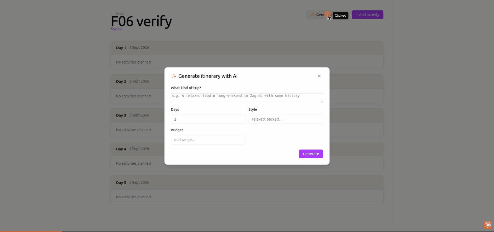
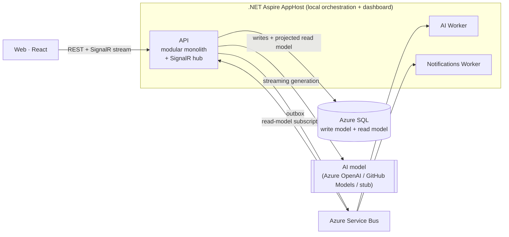

# Explivio

[](https://github.com/danijel-scukanec/explivio/actions/workflows/ci.yml)


> A modern, distributed **.NET 10** trip-planning platform with **AI** at its core — event-driven, observable, tested, and cloud-native.

Explivio is a reference-quality showcase of building a **modern .NET distributed system with first-class AI support**: a modular-monolith API, independently-deployed workers, a transactional outbox over a message broker, a CQRS read model, and AI itinerary generation streamed live to the UI. It favours **clear seams over sprawl** — every architectural choice is meant to be defensible, not cargo-culted.

---

## ✨ Demo — AI itinerary generation, streamed live

Describe the trip in plain language; the model returns a **structured** itinerary that is **streamed over SignalR** and revealed card-by-card, then added to the plan with one click.



*(Shown running against the built-in deterministic stub — no API key required. Point it at a real model to see tokens arrive over several seconds; see [Using a real AI model](#using-a-real-ai-model).)*

---

## Highlights

- **Event-driven core with a transactional outbox** — domain events are persisted in the same transaction as the business change, then relayed to **Azure Service Bus**; consumers dedupe on message id for exactly-once *effect* over at-least-once delivery.
- **Independently-deployed workers** — an **AI Worker** and a **Notifications Worker** consume domain events off their own subscriptions, each with its own inbox-dedupe store.
- **CQRS read model** — a denormalized per-trip dashboard summary in its own SQL `read` schema, kept current by an event-driven projector (projection + inbox committed in one transaction).
- **AI as a product capability** — itinerary generation via `Microsoft.Extensions.AI` with **structured outputs** (typed JSON, no brittle text parsing) and **streaming to the UI over SignalR**. Provider-neutral: Azure OpenAI, GitHub Models, or a local stub, chosen by config.
- **Operable by default** — OpenTelemetry traces/metrics/logs, health/liveness endpoints, and resilience pipelines wired through a shared `ServiceDefaults`, orchestrated locally by **.NET Aspire**.
- **Consistent HTTP contract** — `Result`-based error flow and a global exception handler, all rendered as **ProblemDetails (RFC 9457)**; validation, logging, API versioning, and per-user rate limiting as cross-cutting concerns.
- **Provable** — unit tests plus **Testcontainers** integration tests against a real SQL Server, run in **GitHub Actions** CI.
- **C# is the single source of truth for types** — the OpenAPI spec generates the `@explivio/shared` TypeScript types; frontend types are never hand-written.

---

## Architecture at a glance



The API both **publishes** domain events (via the outbox) and **subscribes** to them (the read-model projector runs inside it). For the full target topology, data architecture, and the reasoning behind each choice, see **[ARCHITECTURE.md](ARCHITECTURE.md)** and the decision records in **[docs/adr/](docs/adr/)**.

---

## Project status

This is an evolving portfolio project. The **committed target** — the foundation plus AI generation and streaming — is **complete**; the rest is a genuine, prioritized roadmap. See **[docs/FEATURES.md](docs/FEATURES.md)** for the full map.

**Built and verified**

| Area | What |
|---|---|
| Orchestration | .NET Aspire AppHost + ServiceDefaults, OpenTelemetry, health/resilience |
| API foundation | Vertical-slice modules (Trips, Users, Itinerary, Budget), MediatR pipeline, ProblemDetails + `Result` flow, API versioning, rate limiting |
| Eventing | Transactional outbox over Azure Service Bus |
| Workers | AI Worker + Notifications Worker (event consumption + inbox dedupe) |
| CQRS | Trip-dashboard read model, event-driven projector |
| AI | Itinerary generation (structured output) + **live streaming over SignalR**, with accept-to-itinerary flow in the web UI |
| Web | Trips, Itinerary (day-by-day + AI generate), Google Places search |
| Quality | Testcontainers integration tests + GitHub Actions CI |

**Roadmap (planned, not yet built)**

Azure deploy via `azd` → Container Apps · RAG over Cosmos vector search · AI chat assistant · receipt/email parsing (vision) · map view · real-time collaboration · push notifications · AI ops (token/cost telemetry, semantic cache, evals) · **real auth (Microsoft Entra External ID — a fake dev identity is used today)** · mobile parity.

---

## Getting started

**Prerequisites:** [.NET 10 SDK](https://dotnet.microsoft.com/), [Docker](https://www.docker.com/) (for SQL + the Service Bus emulator and integration tests), [Node.js](https://nodejs.org/) 20+.

### Option A — Full distributed system via Aspire

Runs the API, both workers, SQL, and the Service Bus emulator together, with the Aspire dashboard for traces and logs.

```bash
cd backend
dotnet run --project Explivio.AppHost
```

The dashboard prints its URL on startup; the API listens on `http://localhost:5298`.

### Option B — API + web only (simplest inner loop)

Runs the API against a local SQL container (no broker; events are written to the outbox but not relayed). AI uses the built-in stub, so **no API key is needed**.

```bash
# 1. SQL Server
docker run -e ACCEPT_EULA=Y -e SA_PASSWORD='TestPSW80!' -p 1433:1433 \
  -d --name explivio-sql mcr.microsoft.com/mssql/server:2022-latest

# 2. Apply the relational migrations (the read model auto-migrates on startup)
dotnet ef database update --project backend/Explivio.API --context AppDbContext

# 3. API  (http://localhost:5298 — Development uses a fake dev identity)
dotnet run --project backend/Explivio.API

# 4. Web  (http://localhost:5173)
cd client && npm install && npm run dev --workspace frontend
```

Then open <http://localhost:5173>, create a trip, open its itinerary, and try **✨ Generate with AI**.

### Using a real AI model

By default the app uses a deterministic **stub** — great for building and CI, zero cost. To generate real itineraries, set three config keys (e.g. via `dotnet user-secrets` in `backend/Explivio.API`) and restart — no code change:

| Key | Example (GitHub Models — free tier) |
|---|---|
| `AI:Endpoint` | `https://models.github.ai/inference` |
| `AI:ApiKey`   | a GitHub token with the Models permission |
| `AI:Model`    | `openai/gpt-4o-mini` |

Any OpenAI-compatible endpoint works, including Azure OpenAI (endpoint + key + deployment name).

### Tests

```bash
cd backend
dotnet test --solution Explivio.slnx
```

Unit tests run anywhere; the integration tests spin up a real SQL Server via Testcontainers (Docker required).

---

## Repository structure

```
explivio/
  backend/           .NET 10 solution (Explivio.slnx)
    Explivio.API/            modular-monolith API (modules, read model, outbox, SignalR hub)
    Explivio.AIWorker/       AI job consumer
    Explivio.NotificationsWorker/  domain-event consumer
    Explivio.AppHost/        .NET Aspire orchestration (local dev)
    Explivio.ServiceDefaults/  shared OTel + health + resilience
    Explivio.*.Tests/        unit + Testcontainers integration tests
  client/            npm workspace
    frontend/          React + Vite (TypeScript)
    mobile/            React Native + Expo (scaffold)
    shared/            types generated from OpenAPI + shared utils
  infra/             Bicep modules (to be superseded by the Aspire/azd model)
  docs/              ARCHITECTURE.md · FEATURES.md · adr/
```

---

## Documentation

- **[ARCHITECTURE.md](ARCHITECTURE.md)** — system topology, data & messaging architecture, AI design, cross-cutting concerns.
- **[docs/FEATURES.md](docs/FEATURES.md)** — prioritized feature map and phased delivery roadmap.
- **[docs/adr/](docs/adr/)** — architecture decision records (modular monolith, outbox, Aspire, deferred auth).
